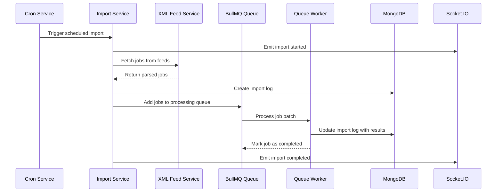
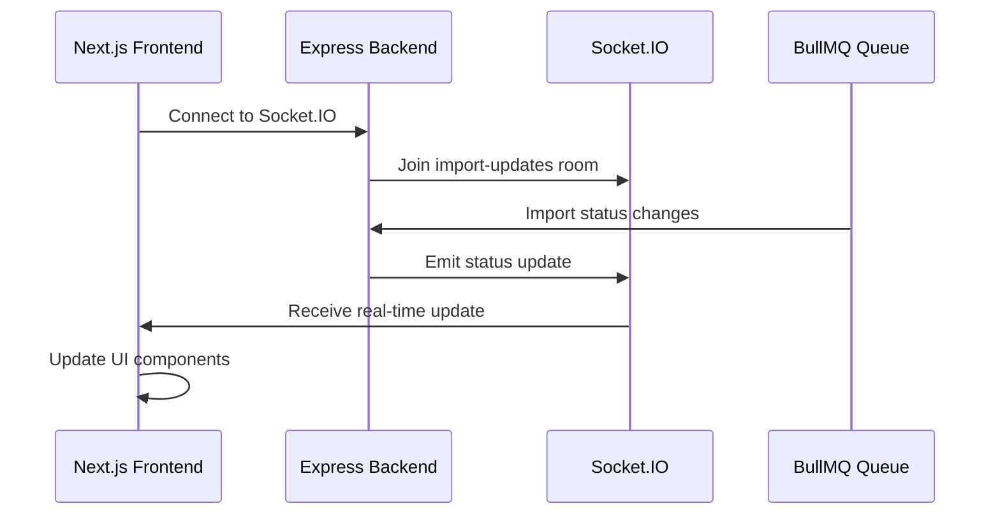

# Knovator Job Importer - System Architecture

## Overview

The Knovator Job Importer is an automated system that fetches job listings from XML feed APIs, processes them through BullMQ queues, and provides real-time monitoring with comprehensive import history tracking.

## System Architecture

```
┌─────────────────┐    ┌─────────────────┐    ┌─────────────────┐
│   Frontend      │    │    Backend      │    │   External      │
│   (Next.js)     │◄──►│   (Express.js)  │◄──►│   XML Feeds     │
└─────────────────┘    └─────────────────┘    └─────────────────┘
         │                       │                       │
         │              ┌─────────────────┐              │
         │              │   Queue System  │              │
         │              │   (BullMQ)      │              │
         │              └─────────────────┘              │
         │                       │                       │
         │              ┌─────────────────┐              │
         │              │   Redis Store   │              │
         │              └─────────────────┘              │
         │                       │                       │
         │              ┌─────────────────┐              │
         │              │   MongoDB       │              │
         │              │   Database      │              │
         │              └─────────────────┘              │
         │                       │                       │
         │              ┌─────────────────┐              │
         │              │   Cron Service  │              │
         │              │   (Automation)  │              │
         │              └─────────────────┘              │
```

## Technology Stack

### Frontend
- **Framework**: Next.js 14
- **Styling**: Tailwind CSS
- **State Management**: React Hooks
- **HTTP Client**: Axios
- **Real-time**: Socket.IO Client
- **UI Components**: Headless UI, Heroicons
- **Notifications**: React Hot Toast

### Backend
- **Runtime**: Node.js
- **Framework**: Express.js
- **Database**: MongoDB with Mongoose ODM
- **Queue System**: BullMQ with Redis
- **Real-time**: Socket.IO
- **XML Parsing**: xml2js
- **HTTP Client**: Axios
- **Scheduling**: node-cron
- **Logging**: Winston
- **Validation**: Joi

### Infrastructure
- **Queue Store**: Redis
- **Database**: MongoDB
- **Deployment**: Vercel (Frontend & Backend)
- **Database Hosting**: MongoDB Atlas
- **Cache Hosting**: Redis Cloud

## Clean Project Structure

```
Knovator-Assignment/
├── client/                          # Next.js Frontend
│   ├── src/
│   │   ├── pages/                   # Next.js pages
│   │   │   ├── index.js            # Dashboard page
│   │   │   ├── import-logs.js      # Import logs page
│   │   │   └── _app.js             # App wrapper
│   │   ├── utils/                   # Utility functions
│   │   │   ├── api.js              # API client functions
│   │   │   ├── socket.js           # Socket.IO client
│   │   │   └── format.js           # Data formatting utilities
│   │   └── styles/                  # Global styles
│   ├── package.json
│   ├── next.config.js
│   ├── tailwind.config.js
│   └── postcss.config.js
│
├── server/                          # Express.js Backend
│   ├── src/
│   │   ├── config/                  # Configuration files
│   │   │   ├── database.js         # MongoDB connection
│   │   │   └── redis.js            # Redis connection
│   │   ├── models/                  # Mongoose models
│   │   │   └── ImportLog.js        # Import log schema
│   │   ├── routes/                  # API routes
│   │   │   ├── import.js           # Import status
│   │   │   └── importLogs.js       # Import logs
│   │   ├── services/                # Business logic
│   │   │   ├── xmlFeedService.js   # XML feed processing
│   │   │   ├── queueService.js     # BullMQ queue management
│   │   │   ├── importService.js    # Import orchestration
│   │   │   ├── cronService.js      # Scheduled imports
│   │   │   └── socketService.js    # Real-time updates
│   │   ├── middleware/              # Express middleware
│   │   │   └── errorHandler.js     # Error handling
│   │   ├── utils/                   # Utility functions
│   │   │   └── logger.js           # Winston logger
│   │   └── index.js                 # Main server file
│   ├── package.json
│   └── env.example
│
└── docs/                            # Documentation
    └── architecture.md              # This file
```

## Core Services

### 1. ImportService
- **Purpose**: Orchestrates the entire import process
- **Responsibilities**:
  - Manages import lifecycle
  - Coordinates between XML feeds and queue system
  - Handles import logging and statistics
  - Provides real-time status updates

### 2. QueueService (BullMQ)
- **Purpose**: Manages job processing queue
- **Responsibilities**:
  - Creates and manages BullMQ queues
  - Handles job scheduling and processing
  - Provides queue statistics
  - Manages worker concurrency

### 3. XMLFeedService
- **Purpose**: Fetches and parses XML job feeds
- **Responsibilities**:
  - HTTP requests to XML feed APIs
  - XML to JSON conversion
  - Data validation and cleaning
  - Error handling for feed failures

### 4. CronService
- **Purpose**: Automates import scheduling
- **Responsibilities**:
  - Scheduled import triggers
  - Cron job management
  - Import frequency control

### 5. SocketService
- **Purpose**: Real-time communication
- **Responsibilities**:
  - WebSocket connections
  - Real-time status updates
  - Event broadcasting

## Data Flow

### 1. Automated Import Process



### 2. Real-time Updates



## Database Schema

### ImportLog Collection
```javascript
{
  _id: ObjectId,
  timestamp: Date,        // Import start time
  sourceFeed: String,     // Source feed URL
  sourceName: String,     // Source feed name
  totalFetched: Number,   // Total jobs fetched
  totalImported: Number,  // Successfully processed
  newJobs: Number,        // New jobs inserted
  updatedJobs: Number,    // Existing jobs updated
  failedJobs: [{          // Failed jobs with reasons
    guid: String,
    title: String,
    reason: String,
    error: String
  }],
  duration: Number,       // Import duration (ms)
  status: String,         // running, completed, failed
  error: String,          // Error message if failed
  queueJobId: String,     // BullMQ job ID
  createdAt: Date,
  updatedAt: Date
}
```

## API Endpoints

### System Status
- `GET /health` - Health check
- `GET /api/import/status` - System status with queue statistics

### Import Logs
- `GET /api/import-logs` - Get import history with pagination and filters
- `GET /api/import-logs/stats/overview` - Get import statistics

## Key Design Decisions

### 1. Queue-Based Processing
- **Decision**: Use BullMQ for job processing
- **Rationale**: 
  - Scalable and reliable job processing
  - Built-in retry mechanisms
  - Real-time job monitoring
  - Redis-based persistence

### 2. Automated Scheduling
- **Decision**: Use node-cron for automated imports
- **Rationale**:
  - No manual intervention required
  - Configurable import frequency
  - Reliable scheduling

### 3. Real-time Updates
- **Decision**: Socket.IO for real-time communication
- **Rationale**:
  - Live status updates
  - Better user experience
  - Immediate feedback

### 4. Simplified Data Model
- **Decision**: Focus on import logs rather than individual jobs
- **Rationale**:
  - Cleaner architecture
  - Easier to maintain
  - Focus on monitoring and tracking

### 5. Microservices Architecture
- **Decision**: Separate services for different concerns
- **Rationale**:
  - Better separation of concerns
  - Easier to test and maintain
  - Scalable design

## Performance Considerations

### Queue Processing
- **Concurrency**: 5 workers processing jobs simultaneously
- **Retry Logic**: Exponential backoff for failed jobs
- **Job Cleanup**: Automatic cleanup of completed jobs

### Database Optimization
- **Indexes**: Optimized for timestamp and status queries
- **Pagination**: Efficient pagination for large datasets
- **Aggregation**: Optimized statistics queries

### Memory Management
- **Stream Processing**: XML feeds processed as streams
- **Batch Processing**: Jobs processed in batches

## Security Features

### API Security
- **CORS Protection**: Configured for specific origins
- **Error Handling**: Sanitized error messages
- **Rate Limiting**: Built-in request limiting

### Data Security
- **Environment Variables**: Sensitive data in environment
- **Connection Security**: Secure database connections

## Monitoring and Logging

### Logging Strategy
- **Winston Logger**: Structured logging
- **Error Tracking**: Comprehensive error logging
- **Performance Monitoring**: Import duration tracking

### Health Monitoring
- **Health Endpoints**: System health checks
- **Queue Monitoring**: Real-time queue statistics
- **Database Monitoring**: Connection status


